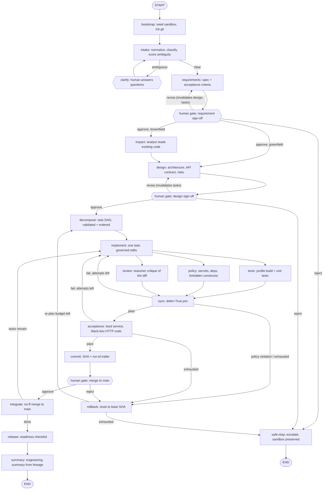

# Architecture

This document describes the system as built. The design plan it grew from is
[plan.md](plan.md); where reality diverged from the plan, this document wins.

## Two codebases, judged differently

- **The orchestrator** (`src/factory/`) is the deliverable: a language-agnostic
  agentic SDLC pipeline. It never edits product code.
- **The product** (a Spring Boot URL shortener in the demo) is what the
  orchestrator builds. It lives in a sandboxed git repository at
  `/tmp/factory/<run_id>`, never inside the orchestrator's tree.

## Division of responsibility

| Layer | Role | Never does |
|---|---|---|
| LangGraph | The brain: stage sequencing, gates, parallel dispatch, retries, re-planning | edit files |
| Claude Agent SDK | The hands: three separately configured roles | touch git, run builds |
| Git | The safety net: commit per task, diff per gate, reset for rollback | — |
| Langfuse | The flight recorder: prompts, tokens, cost, tool calls, denials, scores | — |

Git answers *what changed*; Langfuse answers *why, at what cost, after how many
attempts*. Every commit carries a `Factory-Run-Id` trailer and every trace is
grouped under the run's session id, so the two audit trails correlate.

## The three agent roles

All three are `claude_agent_sdk.query()` calls with different options — one
auth path (`claude /login` subscription or `ANTHROPIC_API_KEY`), no second SDK.

| Role | Tools | Used by | Caps |
|---|---|---|---|
| reasoner | none | intake, requirements, design, decompose, review, summary | 3 turns, $1/call |
| analyst | Read/Glob/Grep | impact (brownfield), read-only by construction | 15 turns, $1.50/call |
| implementer | Read/Glob/Grep auto-allowed; Write/Edit gated by callback; **no Bash** | implement | 40 turns, $3/task-attempt |

Defaults are cost-conscious (`sonnet` reasoner/analyst, `haiku` implementer,
`sonnet` fallback) and overridable per role via `FACTORY_MODEL_*` env vars.
The fallback model is tried exactly once, only when a call dies with an
execution error — blown turn or budget caps propagate, because a different
model would blow them again.

## The stage graph, as built

## Language-agnostic by construction

Everything product-specific hangs off a `ProjectProfile`
(`src/factory/profiles.py`): scaffold template, build/test/package/run
commands, health URL, dependency allowlist, per-language forbidden-construct
regexes, optional external scanners. Exactly three components consume it —
bootstrap (copies the scaffold), the verification stages (run the commands)
and the policy rules (apply the patterns). The graph, gates, state, git ops,
tracing and metrics never mention a language. Supporting a new product stack
means writing a new profile, not touching the orchestrator.

The scaffold template exists because the Maven wrapper contains a binary jar
an LLM cannot fabricate; it is copied, never generated.

## Gates: two distinct mechanisms

**Automated entry/exit gates** (`governance/gates.py`) are predicates on state, checked
mechanically. Example: `implement` cannot enter a task until every task it
depends on is integrated — the decomposition's DAG is enforced, not
decorative.

**Human checkpoints** (`stages/human_gates.py`) are `interrupt()` calls,
reserved for high-impact actions: requirement sign-off, design sign-off,
merge to main, plus clarification when intake scores the request ambiguous.
Gate nodes read state and interrupt — nothing else — because LangGraph
re-executes an interrupted node from the top on resume; any side effect
before the interrupt would run twice. The run parks in a SQLite checkpointer
(`runs/checkpoints.db`) and survives process exits; `factory approve <id>`
resumes it from any process.

## Controlled autonomy: the budget lattice

Every loop in the graph is bounded, and every bound lives in graph state (not
closures), so budgets survive resume:

- **Retries**: 3 implementation attempts per task (`MAX_ATTEMPTS`), failure
  reports fed back into the next attempt's prompt.
- **Policy violations skip retries** — retrying would teach the agent to hide
  the violation, and the diff is already untrusted. Straight to rollback.
- **Rollback**: `git reset --hard` to the last known-good SHA; the failure
  becomes re-plan context for decompose.
- **Re-plan budget**: one rollback-triggered re-decomposition per run; after
  that, safe-stop with the sandbox preserved for a human.
- **Per-call caps**: max turns and max budget USD on every SDK call.
- **Run budget**: an aggregate spend cap for the whole run (`--budget`,
  default $5). Every role invocation reports its cost into state; every
  router that would dispatch more agent work checks the total first and
  safe-stops with the spend stated. Verified work is never discarded by a
  budget stop, and merging it is never blocked.
- **Kill switch**: `factory kill <run_id>` from any terminal. The driver
  checks a sentinel flag between graph supersteps, so a running run halts at
  the next stage boundary with the checkpoint consistent; a parked run
  refuses to resume until `factory kill --clear`. Reversible: kill parks the
  run, it does not destroy it.
- **Fallback model**: one retry on a different model for execution errors.

Re-planning has two triggers: failure (above) and upstream change — a human
`revise` at a gate re-runs the gated stage with the edits and writes `None`
over everything derived from it through the state reducer. Both invalidation
and revision are recorded as decisions; history is append-only.

## Policy enforcement

Three layers, all mechanical:

1. **Permission callback** (`agent/permissions.py`): the implementer's Write/Edit
   calls are decided one at a time — deny anything resolving outside the
   sandbox (`Path.resolve()`, so `../` and absolute paths fail alike) or
   matching a protected glob. Every decision lands in the audit trail and as
   a trace span.
2. **PreToolUse hook**: observation-only record of every tool attempt, even
   auto-allowed reads. Deliberately returns no permission decision — a hook
   allow would bypass the callback.
3. **Policy stage** (`governance/policy_rules.py`): post-hoc diff scanning — secret
   regexes (plus gitleaks when installed), dependency-allowlist enforcement
   on `pom.xml` changes, per-language forbidden constructs. Runs in the
   parallel verification fan-out.

## Key decisions and alternatives

| Decision | Alternative rejected | Why |
|---|---|---|
| Claude Agent SDK as subprocess-style roles | Aider subprocess | one auth path incl. subscription login; native tool governance (`can_use_tool`) instead of trusting a CLI flag |
| Implementer has no Bash | agent runs its own builds/tests | verification must be adversarial: the agent cannot fake a green build it never ran |
| Acceptance suite lives in the orchestrator repo | suite inside the sandbox | the agent is told the contract but never sees the exam; protected-path rules become unnecessary for it |
| Parallel verification (tests ∥ policy ∥ review), `defer=True` join | parallel implementation in worktrees | satisfies "parallel paths with synchronization" without concurrent writers to one tree; read-only branches are race-free by construction |
| Read-only diffs for parallel branches (`diff_readonly`) | staging in each branch | concurrent `git add` races on `index.lock` |
| Gate nodes are interrupt-only | side effects before interrupt | resumed nodes re-execute from the top; effects would double |
| SQLite checkpointer + state-carried budgets | in-memory saver | runs must survive process restarts; budgets must survive resume |
| `ProjectProfile` abstraction | hardcoded Java commands | the factory is graded as an orchestrator, not a Java build script |
| Scores + metrics in SQLite and Langfuse | Langfuse only | metrics must exist even when tracing is down; tracing degrades to no-op, never breaks a run |

## Observability

`observability/tracing.py` wraps Langfuse with one process-wide guard: keys present, not
disabled, host answers a 1-second health probe — otherwise every helper is a
no-op and a missing Langfuse can never break a run. Per run: a session groups
all traces; stage spans mirror the graph; generation spans carry model,
truncated prompt/output, token usage and cost; tool spans record every
implementer tool attempt (denials at WARNING level); reliability scores are
attached at run end. `docker-compose.langfuse.yml` brings up the self-hosted
stack with keys pre-seeded — zero UI setup.

`observability/metrics.py` persists every run's metric events to `runs/metrics.db` and
computes success rate, first-attempt success rate, retries, rollbacks, MTTR
(wall-clock from a failing verification to the next passing one, per stage)
and end-to-end latency with a per-stage breakdown. `factory metrics [run_id]`
renders it.
