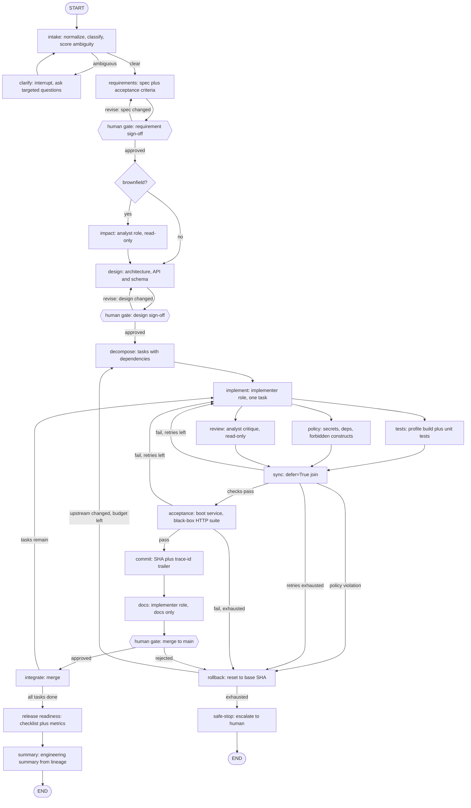

# Software Factory: Agentic SDLC Orchestrator

A LangGraph orchestration layer that drives a seven-stage SDLC with entry/exit gates, parallel
verification, policy guardrails, reliability metrics and human approval checkpoints. All file edits
are delegated to the Claude Agent SDK. Git and Langfuse provide audit-grade traceability. The
factory is language-agnostic through project profiles; the demo product is a Java Spring Boot URL
shortener.

## Two codebases, judged differently

This distinction drives everything and should be stated up front in the architecture overview.

- The orchestrator is the deliverable being graded on Req 4, system design, and validation rigor. It never edits product code.
- The URL shortener is the product the orchestrator builds, graded on Req 5 realism and output quality. It lives in a sandboxed git repo at `/tmp/factory/<run_id>`, never in the orchestrator's own tree.

Keep the shortener deliberately small: `POST /shorten`, `GET /{code}` redirect, `GET /{code}/stats`, Spring Boot 3 with an embedded H2 database, hit-count analytics, and a rate-limiting filter as the reliability feature. Req 4 is the stated critical differentiator and carries most of the evaluation weight, so orchestration depth beats product surface area.

## Language-agnostic by construction

The orchestrator never hardcodes a product language. Everything product-facing hangs off a `ProjectProfile`:

```python
@dataclass
class ProjectProfile:
    language: str                     # "java"
    scaffold_template: Path           # seeded into the sandbox at bootstrap
    build_cmd: list[str]              # ["./mvnw", "-q", "compile"]
    test_cmd: list[str]               # ["./mvnw", "-q", "test"]
    run_cmd: list[str]                # ["java", "-jar", "target/app.jar"]
    package_cmd: list[str]            # ["./mvnw", "-q", "package", "-DskipTests"]
    health_url: str                   # polled before acceptance runs
    dependency_files: list[str]       # ["pom.xml"]
    dependency_allowlist: set[str]
    forbidden_patterns: list[str]     # per-language policy regexes
    protected_globs: list[str]
```

Only three components consume it: bootstrap (copies the scaffold), the verification stages (run the commands), and the policy rules (apply the patterns). The graph, gates, state, git operations, tracing and metrics never mention a language, which is the proof that this is an orchestration layer rather than a Python-project script. Building a different product means writing a different profile.

The scaffold template exists for a practical reason: the Maven wrapper includes a binary jar that an LLM cannot fabricate, so `templates/java-springboot/` ships `mvnw`, `.mvn/wrapper/` and a minimal `pom.xml`, copied into the sandbox before the agent ever runs. It also means the testing team needs a JDK but not Maven.

## Division of responsibility

- LangGraph is the brain: stage sequencing, gates, parallel dispatch, re-planning. Never edits files.
- Claude Agent SDK is the hands, in three separately configured roles.
- Git is the artifact lineage: commit per stage, diff at each gate, reset for rollback.
- Langfuse is the flight recorder: prompts, models, tokens, cost, latency, retries, denied tool calls, gate decisions, reliability scores.

Git and Langfuse are complementary. Git answers what changed; Langfuse answers why, at what cost, and after how many attempts. Req 4 asks for decision lineage and audit-grade traceability, which needs both plus the correlation between them.

## Three SDK roles, one auth path

All three are `claude_agent_sdk.query()` with different `ClaudeAgentOptions`. No `langchain-anthropic`, no second API key.

- Reasoner: `allowed_tools=[]`. No tools means no filesystem access at all. Used for intake, requirements normalization, design, decomposition, re-planning and the final summary.
- Analyst: `allowed_tools=["Read", "Glob", "Grep"]`. Read-only, for brownfield impact analysis under Req 3. Structurally incapable of mutating the code it analyses.
- Implementer: `allowed_tools=["Read", "Write", "Edit", "Glob", "Grep"]`, `permission_mode="acceptEdits"`, `cwd` pinned to the sandbox. `Bash` is deliberately omitted, so it cannot commit, cannot run tests, and cannot shell out.

Each role sets `model`, `fallback_model`, `max_turns` and `max_budget_usd`. `fallback_model` is the literal implementation of the Req 4 fallback control.

Auth: existing `claude /login` OAuth, or `ANTHROPIC_API_KEY`. Document the precedence trap, since a stale key silently overrides subscription auth in non-interactive mode.

Product-side prerequisite: JDK 21+. Maven itself is not required, since the wrapper ships in the scaffold template.

## Stage graph



## Gates are two distinct mechanisms

The brief asks for both "entry/exit gates" and "human approval checkpoints for high-impact actions". These are different things and conflating them is the easy mistake.

Automated gates, in `gates.py`, are predicates on state. Every stage declares an entry condition, checked before it runs, and an exit condition, checked after. A failed entry condition means the dependency graph was violated and routes to re-plan. A failed exit condition routes to retry or rollback. Example: `design` cannot enter without an approved spec containing acceptance criteria; `implement` cannot exit unless the diff is non-empty and touches only permitted paths. A third example matters for Req 2: `implement` cannot enter a task unless every task it depends on has been integrated, which keeps the decomposition's dependency graph enforced rather than decorative. The task DAG itself is rendered into the final summary as an artifact.

Human checkpoints are `interrupt()` calls, reserved for high-impact actions only, so the system is not gating on every trivial step:

- Requirement sign-off, after ambiguity resolution
- Design and API contract sign-off
- Merge to main
- Adding a new dependency
- Any schema or migration change
- File deletion

Everything else runs autonomously. That explicit boundary is the Req 7 "defined autonomy boundaries" answer.

## Parallel verification and synchronization

After `implement`, three branches fan out in one superstep: `tests`, `policy`, and `review`. They join at `sync`, declared `builder.add_node(sync, defer=True)` so it waits for all branches even if they take unequal numbers of steps.

Two properties of LangGraph supersteps matter here and are worth stating in the writeup:

- Parallel supersteps are transactional. If any branch raises, no state updates from that superstep are applied. A failed verification cannot leave partially-updated governance state.
- Concurrent writes to the same state key raise `InvalidUpdateError` unless the key has a reducer. Every field the parallel branches touch must carry one: append-only lists for lineage, and a keyed dict merge for stage results (see the next two sections).

All three parallel branches are deliberately read-only with respect to the working tree. Concurrent writers to a single git worktree would race, and the correct fix is a worktree per branch plus a merge step. That is real work for marginal demo value, so v1 keeps writes sequential and `docs` runs after `sync`. Record this as an explicit documented trade-off rather than an oversight, and note the worktree-per-branch design as the scaling path.

## Re-planning on upstream change

The brief's "dynamically re-plan when upstream outputs change" is not the same thing as retrying on failure, and the plan needs both triggers.

- Failure-triggered: retries exhausted or a policy violation rolls back to the base SHA and re-plans with the failure context attached.
- Upstream-change-triggered: the requirement and design gates accept a `revise` response carrying edits, not just approve or reject. A revised spec invalidates the design, the task list and all later stage results; a revised design invalidates the task list onward. The affected stages then re-run against the new upstream truth.

Capture at least one gate revision in a scenario run, because this behavior only earns credit if a grader can watch it happen.

Invalidation dictates the state design, and this is easy to get wrong: an `operator.add` reducer is append-only, so no node can ever clear it. Working artifacts therefore live in `stage_results`, a dict keyed by stage with a custom merge reducer. Parallel branches write disjoint keys, so concurrency stays safe, and an invalidation writes `None` over the downstream keys. Lineage fields stay append-only on purpose: history is never erased, and each invalidation is itself recorded as a `Decision` with its rationale.

## State and decision lineage

```python
class Decision(TypedDict):
    stage: str
    decision: str
    rationale: str
    alternatives: list[str]
    commit_sha: str | None
    trace_id: str | None
    at: str

class FactoryState(TypedDict):
    goal: str
    scenario: Literal["greenfield", "brownfield", "ambiguous"]
    spec: dict | None              # normalized requirement plus acceptance criteria
    ambiguities: list[str]
    impact: dict | None            # brownfield analysis
    design: dict | None
    tasks: list[dict]              # with dependencies and sequencing
    task_idx: int
    base_sha: str                  # rollback target
    head_sha: str | None
    attempts: int                  # in state, not a closure, to survive resume
    stage_results: Annotated[dict[str, Any], merge_stage_results]  # keyed by stage; None = invalidated
    risks: Annotated[list[dict], operator.add]           # risk register from design and review stages
    decisions: Annotated[list[Decision], operator.add]
    audit: Annotated[list[dict], operator.add]
    metric_events: Annotated[list[dict], operator.add]
```

`decisions` is the cross-stage context and decision lineage required by Req 4, and the final engineering summary in Req 8 is generated from it rather than written by hand. `risks` is the Req 6 artifact: the design stage emits identified risks, trade-offs and failure scenarios with mitigations, the review branch appends anything it finds, and the summary reports each risk with its outcome.

## Policy guardrails

`policy_rules.py`, enforced at two levels. Preventively via the `can_use_tool` callback, which denies a write before it happens. Detectively via the `policy` branch, which scans the resulting diff.

- Sandbox confinement: no path outside `/tmp/factory/<run_id>`
- Protected paths: profile-defined globs; the acceptance suite needs none because it lives outside the sandbox entirely
- Secret scanning: two layers — built-in regexes over added diff lines (the deterministic, zero-dependency floor) plus optional external scanners named by the profile (`gitleaks` for the demo profile, run with `--redact` against the sandbox tree). A missing scanner binary degrades to the baseline and is recorded as skipped in the audit trail, never silently
- Dependency allowlist: new `pom.xml` coordinates must be on the profile's list (Spring Boot starters, H2, JUnit), otherwise it is a high-impact action needing approval
- Forbidden constructs, per language from the profile; the Java set is `Runtime.getRuntime().exec`, `ProcessBuilder`, `System.exit` and reflection-based classloading in generated product code
- Change control: main is only reachable through `integrate`, which requires an approved merge gate

Denials are recorded as audit events and as Langfuse tool spans, so the guardrails are observable rather than merely asserted.

## Two test suites with different owners

Req 5 requires the system to produce unit and integration tests, while the gate needs tests the agent cannot influence. Those are different suites and the distinction should be explicit.

- Agent-authored unit and integration tests (JUnit) are part of the product deliverable. The implementer writes them alongside the Java code, they live in the product repo, and they run in the tests branch through the profile's test command.
- The hand-written acceptance suite is the actual gate, and it is black-box: pytest plus `httpx` speaking HTTP to the running service, living in the orchestrator's repo rather than the sandbox. The agent cannot touch it because it never sees it — structural protection, stronger than any path rule. It is also language-agnostic by construction, since the gate tests the API contract rather than the implementation. Agent-authored tests passing never substitutes for it, otherwise the agent grades its own homework.

The acceptance stage runs after the parallel branches join and before commit: package the jar, start the service, poll the health endpoint with a deadline, run the HTTP suite, and always kill the process group in a finally block so a hung service cannot wedge the graph.

The acceptance suite also encodes the product's security behavior explicitly, because a URL shortener's classic vulnerability is an open redirect: reject non-http(s) schemes such as `javascript:` and `data:`, define collision behavior for short codes, and assert rate-limit responses under burst traffic. That gives the "secure code" evaluation criterion a concrete, testable answer at the product level.

## Testing the orchestrator itself

The evaluation criteria ask for modular, testable, reliable code, and the graded artifact is the orchestrator, not just the product it emits. The SDK role wrappers in `claude.py` are the seam: mock the three roles and the entire graph runs deterministically. `tests/factory/` covers the gate predicates, the policy rules, metrics computation, git operations against throwaway temp repos, and every conditional routing function against fabricated states. This suite runs with no Claude auth, no Docker and no network, which also means a grader can verify the system's control logic before spending a single token.

## Observability

Two integration points, because graph structure and model calls are instrumented differently.

Graph structure via the LangChain callback:

```python
from langfuse.langchain import CallbackHandler
graph = builder.compile(checkpointer=saver).with_config({"callbacks": [CallbackHandler()]})
```

Model calls need manual observations. Our nodes call the Agent SDK directly, so the callback handler will show the nodes but not a single LLM call inside them. Wrap each role call as `as_type="generation"` with `model`, prompt, output and `usage_details` / `cost_details` from the SDK result message. Emit one `as_type="tool"` child per tool invocation, sourced from the `PreToolUse` hook, including denials. Truncate inputs and outputs; file contents and build output will otherwise bloat traces.

Correlate the two logs: use the LangGraph `thread_id` as the Langfuse `session_id` via `propagate_attributes(session_id=...)`, and write the trace id into a git commit trailer. A reviewer can then go from any commit to the reasoning that produced it and from any trace to the resulting diff.

## Reliability metrics

Req 4 names four explicitly. Compute in `metrics.py` from `metric_events`, persist per run to SQLite, and emit as Langfuse scores via `langfuse.create_score(name=..., value=..., trace_id=...)`.

- Success rate: stages passing their exit gate on first attempt, over stages attempted
- Retry frequency: retries per run, and per stage
- Rollback frequency: rollbacks per run
- MTTR: wall time from the first failing exit gate to the next passing one
- End-to-end latency: run start to release readiness, plus per-stage breakdown

Aggregate across runs with the Metrics API v2 through `langfuse.api.metrics.get(query=...)`, and expose a `factory metrics` CLI command that prints the table. This is a deliverable in its own right; do not leave it as an afterthought.

## Self-hosted Langfuse, pre-seeded

Ship `docker-compose.langfuse.yml` so the testing team needs no signup. Headless initialization is the decisive detail: Langfuse reads `LANGFUSE_INIT_ORG_ID`, `LANGFUSE_INIT_PROJECT_ID`, `LANGFUSE_INIT_PROJECT_PUBLIC_KEY`, `LANGFUSE_INIT_PROJECT_SECRET_KEY`, `LANGFUSE_INIT_USER_EMAIL` and `LANGFUSE_INIT_USER_PASSWORD` at startup and provisions them if absent. Bake fixed development keys into the compose file and `.env.example` so `docker compose up -d` yields a working instance with keys the app already knows.

- Six services are required in v3: `langfuse-web`, `langfuse-worker`, `postgres`, `clickhouse`, `redis`, `minio`. Multi-gigabyte pull, a few minutes on first start. Say so in the README.
- Publish only port 3000. The upstream reference compose also exposes 5432, 6379, 8123, 9000 and 9090, which will collide with whatever the tester already runs.
- Pre-fill `NEXTAUTH_SECRET`, `SALT` and `ENCRYPTION_KEY`, clearly labelled as throwaway development values.

Tracing must still degrade gracefully, since Docker may be unavailable. Gate everything behind a guard in `tracing.py` returning no-op context managers when keys are missing or the host is unreachable, with `LANGFUSE_TRACING_ENABLED=false` as the documented off switch. A grader who skips Docker should still get a complete run, without traces.

## The three scenarios chain naturally

Run them in order against the same sandbox repo, which is both cheaper to build and a better demo narrative.

1. Greenfield: "Build a URL shortener with shorten, redirect and stats endpoints." Exercises the full stage graph from an empty repo.
2. Brownfield: "Add per-day click analytics and rate limiting." Now there is real code to reason about, so the analyst role produces a genuine impact analysis naming affected modules, routes and data flows, satisfying Req 3.
3. Ambiguous: "Make it more reliable." Intake scores this as ambiguous, enumerates the specific ambiguities, and interrupts to ask the human targeted questions before any code is written.

Capture each run's trace, commit history, decision lineage and metrics as committed artifacts, so the deliverable is reviewable without re-running anything.

## Critical implementation details

- The human gate nodes contain only `interrupt()` and a routing decision. LangGraph re-executes a node from the beginning on resume, so a commit or SDK call placed before the interrupt would run twice.
- `bootstrap` must create an initial commit, or there is no SHA for `git reset` to target and rollback silently no-ops on the first iteration.
- The first-iteration bar is a successful build, not passing tests, since greenfield starts as the seeded Maven skeleton with no code. Give the first Maven run a long timeout because it downloads dependencies; subsequent runs are fast.
- Truncate build and test output to roughly the last 100 lines before feeding it back to `implement`; Maven stack traces are enormous.
- Store `base_sha` and `head_sha` in state so a resumed checkpoint and the working tree cannot diverge.
- Set `recursion_limit` on the compiled graph as a backstop against a misrouted conditional edge.
- Safe-stop is not only the exhaustion path. Every superstep is checkpointed, so interrupting the process at any moment is safe and the run resumes from the last checkpoint; document the Ctrl-C and resume semantics in the README as the human's always-available stop control.

## Files

```
src/factory/
  state.py, graph.py, gates.py, claude.py, permissions.py, profiles.py,
  policy_rules.py, git_ops.py, verify.py, tracing.py, metrics.py, cli.py
  stages/  intake, requirements, impact, design, decompose,
           implement, tests, policy, review, acceptance, docs, release, summary
templates/java-springboot/ # Maven wrapper, pom skeleton, seeded at bootstrap
tests/acceptance/          # black-box HTTP contract tests, hand-written, outside the sandbox
tests/factory/             # orchestrator unit tests, SDK roles mocked, no auth needed
scenarios/                 # three runnable scenario scripts plus captured outputs
docs/architecture.md, docs/testing-approach.md, docs/engineering-summary.md
docker-compose.langfuse.yml, .env.example, README.md
```

## Scope risk, stated plainly

Req 4 alone lists roughly a dozen capabilities, and the brief also wants a production-quality product, three scenarios and five documents, in two to three days. Everything here is achievable only because the product is kept small. If time compresses, cut in this order: worktree-per-branch parallel writes, cross-run metrics aggregation via the Metrics API, then the `review` branch. Do not cut the human gates, rollback, policy enforcement or metrics, since those are the graded differentiators.

## Sequencing

Day 1: scaffold, state and lineage, git ops, the three SDK roles, tracing guard, and the sequential spine proven end-to-end. Instrument from the start; retrofitting spans means touching every node twice.

Day 2: automated entry/exit gates, the parallel verification superstep with reducers, bounded retries, model fallback, rollback and safe-stop, then the human gates on a SQLite checkpointer with the approval CLI. Write the factory unit tests alongside each module as it lands, not as a day-three batch.

Day 3: ambiguity detection and clarification, both re-plan triggers with downstream invalidation, metrics and the report command, the three scenario runs captured as artifacts including one gate revision, and the deliverable documents.

## Implementation checklist

- [x] Scaffold the orchestrator package, dependencies, `.env.example` and README skeleton; document the stale `ANTHROPIC_API_KEY` precedence trap
- [x] `state.py`: keyed stage-results dict with a merge reducer that supports invalidation, append-only lineage fields for decisions, audit and metric events, a risk register; `Decision` records carrying stage, rationale, alternatives, commit SHA and trace id
- [x] `git_ops.py`: init with initial commit, commit with trace-id trailer, diff, reset, merge; every call returns a SHA
- [x] `claude.py`: the three SDK roles with per-role model, fallback model, turn and budget caps
- [x] `profiles.py` and `templates/java-springboot/`: the language profile with build, test, package and run commands, per-language policy patterns, dependency allowlist, and the Maven wrapper skeleton seeded at bootstrap
- [x] `permissions.py` and `policy_rules.py`: sandbox confinement, profile-defined protected paths, secret scanning (built-in regexes plus optional gitleaks), pom.xml dependency allowlist, per-language forbidden constructs; denials recorded as audit events
- [x] verification stages (`stages/tests_stage.py`, `stages/acceptance.py`): the profile's build and test commands with hard timeouts and output truncation, plus the acceptance service lifecycle: package, start, health poll, HTTP suite, teardown in a finally block
- [x] `gates.py`: per-stage entry and exit predicates including the task-dependency entry check for `implement`, plus the high-impact action list driving human approval
- [ ] `docker-compose.langfuse.yml`: six services, headless init with fixed dev keys, only port 3000 published
- [x] `tracing.py`: no-op guard, callback handler, generation spans per role, tool spans from the PreToolUse hook
- [ ] `metrics.py`: success rate, retry and rollback frequency, MTTR, end-to-end latency; SQLite persistence, Langfuse scores, CLI report
- [ ] `tests/factory/`: orchestrator unit tests with the SDK roles mocked, covering gates, policy, metrics, git ops and routing; no auth, Docker or network needed
- [ ] Sequential spine proven end-to-end on a trivial goal
- [ ] Parallel verification superstep with `defer=True` join and reducer-backed fields
- [ ] Bounded retries, model fallback, rollback, safe-stop, and both re-plan triggers: failure-driven and gate-revision-driven, with downstream invalidation
- [ ] Human approval interrupts at requirement sign-off, design sign-off and merge, with checkpointer and approval CLI
- [ ] Ambiguity detection in intake with a clarification interrupt
- [ ] Hand-written black-box HTTP acceptance suite (pytest plus httpx, with a service lifecycle fixture) for the shortener API contract, encoding security behavior: URL scheme allowlist, collision handling, rate limiting
- [ ] The three scenario runs captured as committed artifacts, including one gate revision demonstrating upstream-change re-planning
- [ ] Architecture overview, setup instructions, testing approach with limitations and trade-offs, final engineering summary
